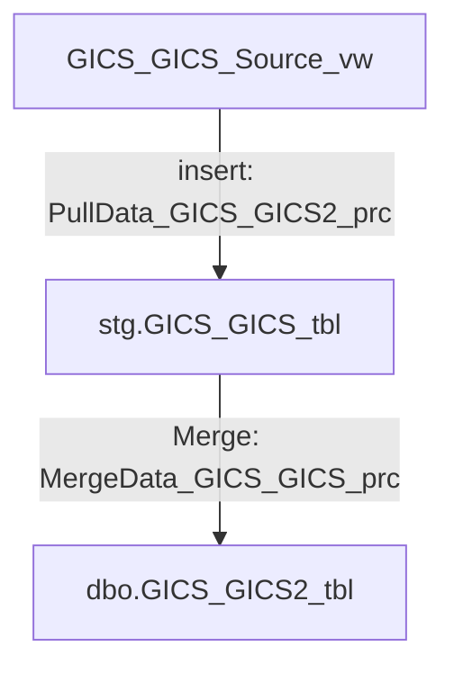

### Python scripts to facilitate work with SQL objects, - cloning of the tables, creation of SPs using some patterns

#### Initial prerequisites:
For a given name of entity (in terms of S&P packages it has a 1 to 1 relation to the "file name"), we have some table (referred to as a target table) and source view. Source view and target table usually have the same schema, and usually, their names are derived from the entity name using a simple naming convention. For example, for the entity "GICS_GICS," we have `GICS_GICS_tbl` and `GICS_GICS_Source_vw` view. In some cases, this naming convention looks slightly different, like for "Symbol_DandBSymbol" we have `Symbol_DandBSymbol_tbl` but `Symbol_DandB_Source_vw` view.

#### Functionality
Given a set of names of the entities for tables and view (for standard naming convention view names could be ommited, we should be able to:
- Create a clone of this table in the same schema using a different name, and create a clone of this table in the "stg" schema.
- Create a clone of the source view, and apply to SQL code of that view some transformations, like replacements of some tables, databases, or whatever.
- Create an SP from the "PULL.." category, which pulls data from the source view and inserts it into the newly created table in the "stg" schema.
- Create an SP from the "MERGE.." category, which pulls data from the staging table and merges it into the clone of the target table.
- Check the execution of the whole chain: SourceView ->PULL_SP->StagingTable->MERGE_SP->TargetTable (cloned)




In terms of delivery, it should:
- For each created or modified SQL object, create DDL script and put it in the git repository folder.
- Accumulate all these definitions in the common script (new file or clipboard), so that the developer could apply it later on dev.

#### Data sources:
- Metadata related to tables schema from database.
- Definitions of tables and views from SQL scripts from Visual Studio Database projects.

#### Configuration
Parameters that are supposed to be changed each launch are configured in [yaml file](configs/launch_configs/launch_config.yml). Example of such a file:
```yml
input_folder: 'C:\Users\dmitrii_kalmanovich\source\repos\DataFeedEngine\DataFeedEngineMI2\dbo'
# folder inside Visual Studio database projects
output_folder: 'D:\Code\DatabaseBuild\Instances\DATAFEEDENGINE\Databases\DataFeedEngineMI'
# folder to save resulting script, that supposed to be commited to git repo later and be a part of implementation plan

entities:
  - GICS_GICS
  - FutureEventMkt_FutureEventMktToObjectToEventType  

src_views_ents:  # for views have to create another set of names due to naming inconsistencies
  - GICS_GICS 
  - KeyDev_FutureEventMktToObjectToEventType

stages: # names of stages we are going to launch
  - CLONE_TABLE
  - CLONE_VIEW
  - CREATE_MERGE_SP
  - CREATE_PULL_SP

code_replacements: # regex patterns we are going to apply when cloning the views
- re_replace_this: \[?(DatafeedEngine\]?|DatafeedEngineCache)\.\[?dbo\]?\.\[?Universe_DailyCompany_tbl\]?
  replace_to: dbo.Universe_Company2_tbl
- re_replace_this: \bCIQDataSnapshot\.
  replace_to: CIQData.
- re_replace_this: \bCREATE\s+VIEW\s+
  replace_to: "CREATE or ALTER VIEW "
```

Naming conventions, as they do not change frequently, are hardcoded [inside python module](sql/naming_convention.py). Also, you need to write the proper SQL connection string here [config file](sql/config.py).

### Launching
The main entry point is [main.py](main.py) module. It can either take parameters from the yaml config or from command line arguments. For dev testing, we can use a set of tests inside the [tests](tests) folder. For performance tests, we can use [test_flow.ipynb](test_flow.ipynb) notebook.
